## Estudiante: Samuel Meneses Diaz, smenesesd@eafit.edu.co
## Materia: Topicos especiales de telematica
## Profesor: Edwin Nelson Montoya Munera, emontoya@eafit.edu.co 
#
# Lab 6 -  Wordcount en Apache Spark EN AWS EMR 6.3.1
# 1. Breve descripción de la actividad
En este laboratorio se afianzaron y se pusieron a prueba  los conocimientos en la gestion de archivos en HDFS, EMR y S3 para big data.

# 1.1 Que aspectos cumplió o desarrolló de la actividad propuesta por el profesor (requerimientos funcionales y no funcionales)
- Creacion de cluster
- Creacion de cuenta y activacion de servicio HUE dentro del cluster
- Se hizo uso de Pyspark para el wordcount para el manejo de datos en HDFS y S3
- Se hizo uso de JupyterHub Notebooks EMR con datos en s3

# 2. Información general de diseño de alto nivel, arquitectura, patrones, mejores prácticas utilizadas.
- Se hizo uso de el servicio de AWS llamado S3 (Almacenamiento de datos seguro en la nube), la cual es un servicio de almacenamiento de objetos que ofrece escalabilidad, disponibilidad de datos, seguridad y rendimiento. En este laboratorio se hizo uso de este servicio para almacenar los datos en los buckets.

# 3. Descripción del ambiente de desarrollo y técnico: lenguaje de programación, librerias, paquetes, etc, con sus numeros de versiones.
Lo primero que debemos de tener en cuenta es en la creacion del cluster, en este mismo repositorio si te vas a lab05-01, en el README.md te apareceran las imagenes e indicaciones para crear tu cluster, en este caso se clono el cluster utilizado en el lab5.   
## Conexion al cluster y envio de carpetas   

1    
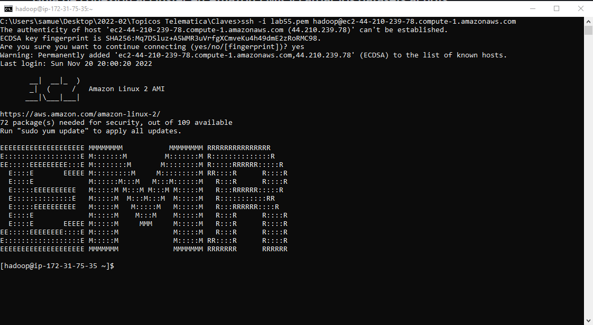
```ssh -i lab55.pem hadoop@ec2-44-210-239-78.compute-1.amazonaws.com ```
   
2.Cargamos los datasets al bucket s3
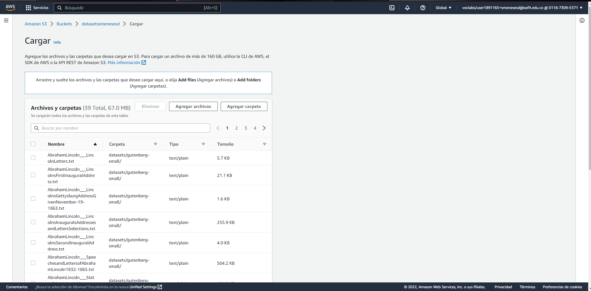   

3.Hacemos la creacion de la carpeta ```/user/hadoop/datasets ```   
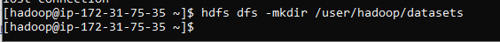   

4.Realizamos un ```scp -r -i Desktop/2022-02/lab06/Claves/lab55.pem Desktop/2022-02/st0263-2022-2-main/bigdata/datasets/ hadoop@ec2-44-210-239-78.compute-1.amazonaws.com: ``` Para asi poder cargar en nuestro EMR master los archivos con los que vamos a hacer estas pruebas   
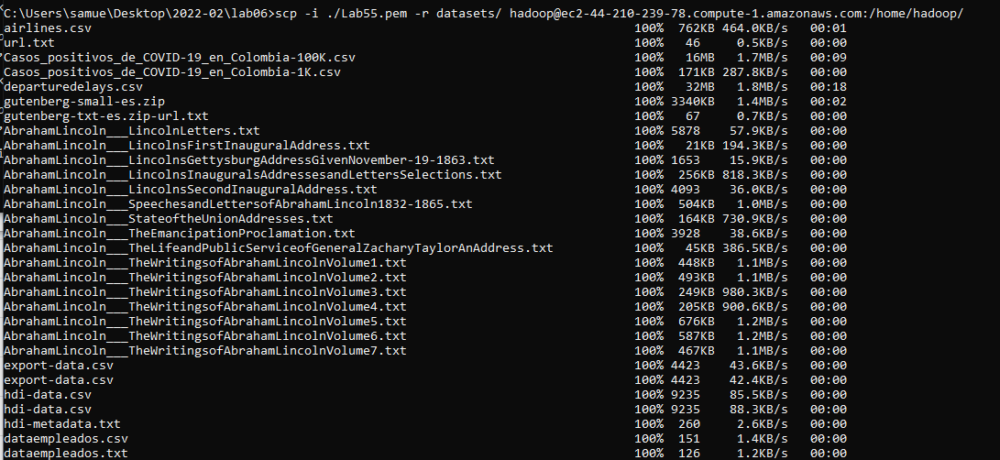    
5. Hacemos un ls en el master para ver que si se nos copio la carpeta de datasets en nuestro master   
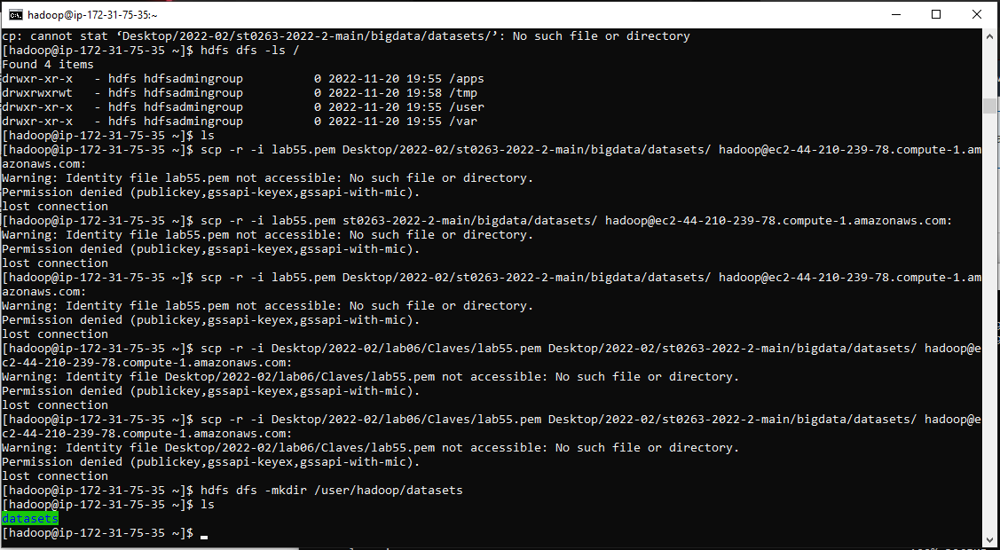   
6. Para finalizar con este envio de carpetas, realizaremos una copia de la carpeta datasets al HDFS   
   
Con su respectiva verificacion   
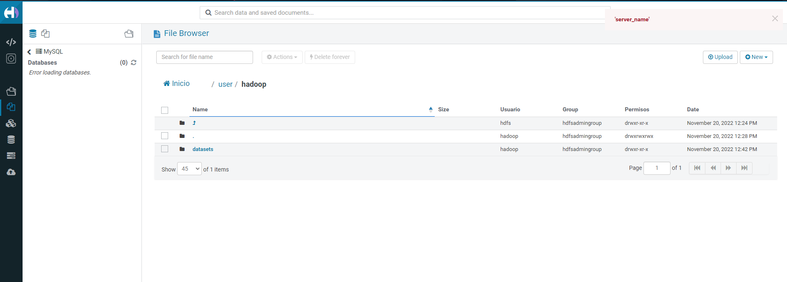   

## Conexion a pyspark y comandos realizados con HDFS
## HUE
1.Realizamos la conexion a pyspark
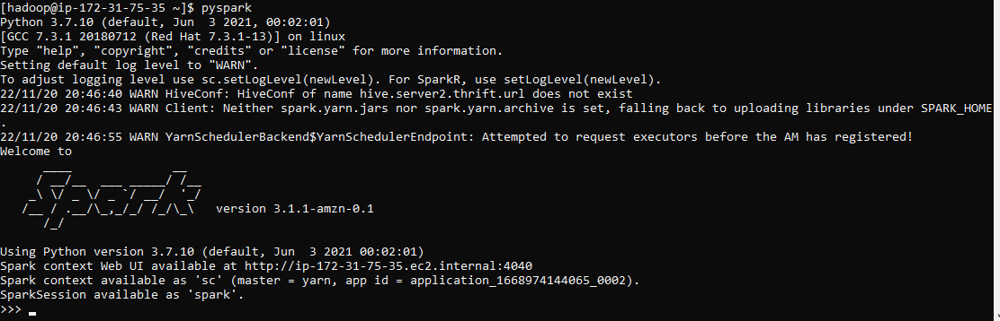   

2.Comandos realizados en la terminal de pyspark   
   

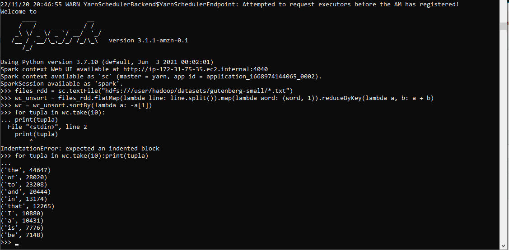   

   

2.Se realiza la verificacion en HUE   
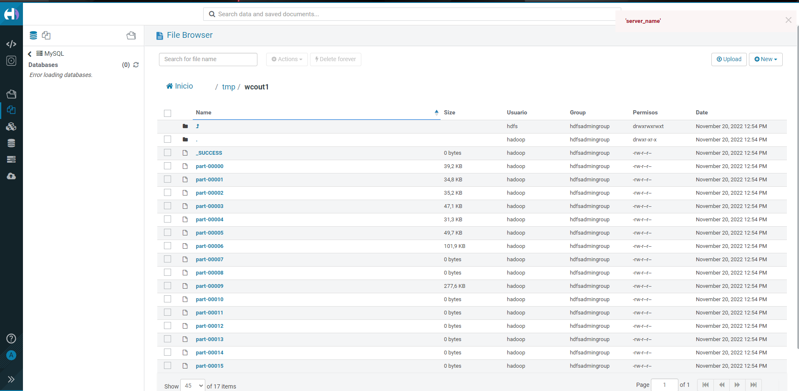   

## S3

Realizamos lo mismo pero esta vez no iria a HDFS sino a S3   
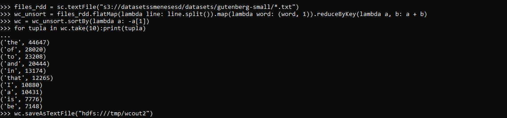   

   

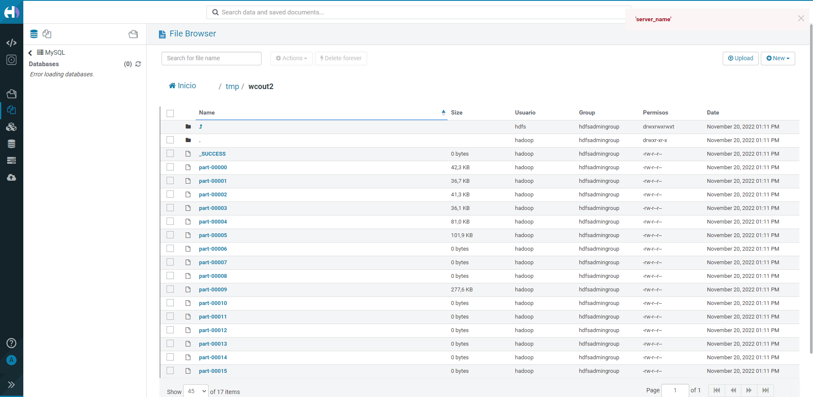  

## Ejecucion del wordcount en JupyterHUB con datos S3   
1.Se hace un ingreso a Jupyter y cargamos el notebook del profesor y ejecutamos el wordcount   
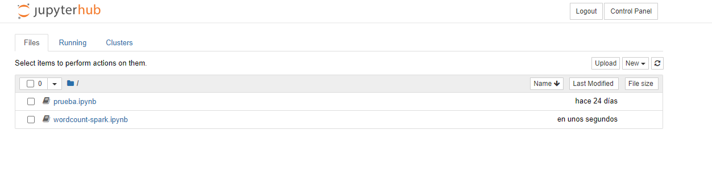 
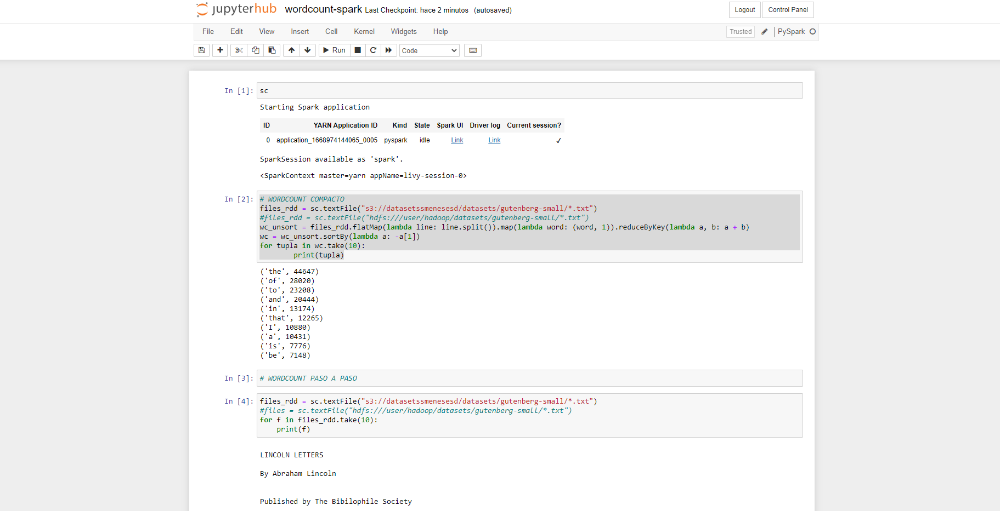   
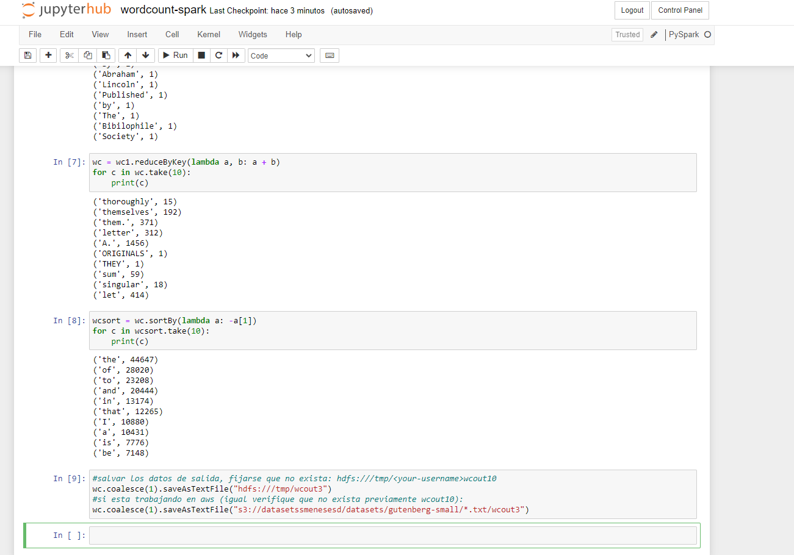

2.Se realiza la verificacion en HUE con el wcount3   
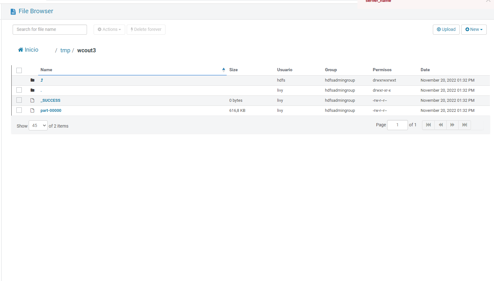  
Y en el S3   
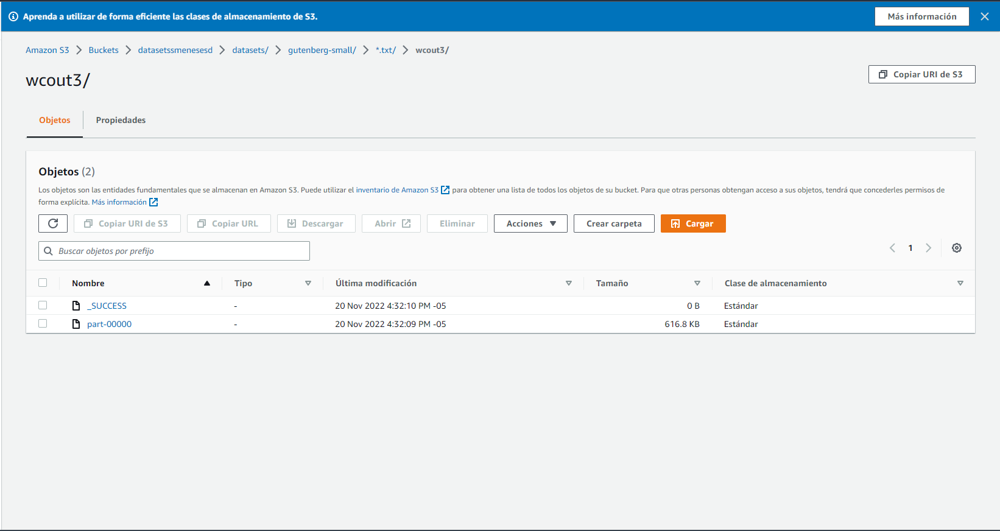   

3. Se hizo una replicacion de los datos ubicados en Data_processing_using_PySpark.ipynb y se entendio la manera de replicacion   
Carpetas dentro de jupyter fueron:   
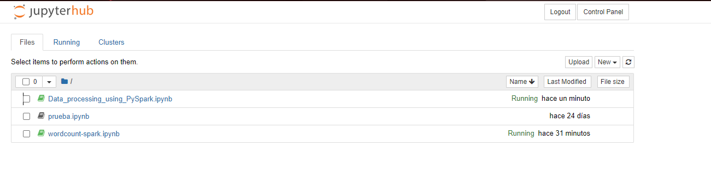   

Ejecuccion del codigo dentro de jupyter:   
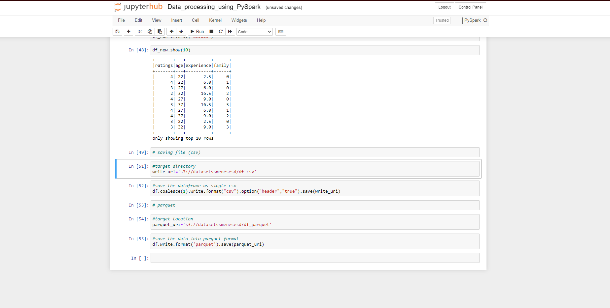  

Revision del s3 despues de replicar los datos de data processing:   
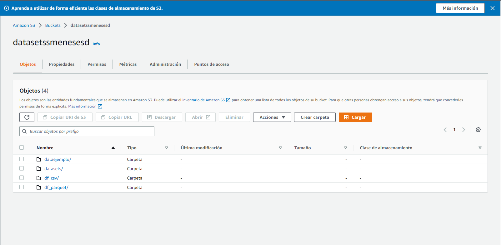


