## Estudiante: Samuel Meneses Diaz, smenesesd@eafit.edu.co
## Materia: Topicos especiales de telematica
## Profesor: Edwin Nelson Montoya Munera, emontoya@eafit.edu.co 
#
# Proyecto 3 - Spark con Notebooks y PySpark
# 1. Breve descripción de la actividad
En este proyecto se afianzaron y se pusieron a prueba  los conocimientos en la gestion de archivos en google colab, PySpark, SQL, dataframe, AWS S3 para big data.

# 1.1 Que aspectos cumplió o desarrolló de la actividad propuesta por el profesor (requerimientos funcionales y no funcionales)
- Se hizo uso de Pyspark para el wordcount para el manejo de datos en HDFS y S3
- Se hizo uso de SparkSQL, Google Colab.
- Se utilizo AWS S3 y google drive para almacenar datos
- Se cargaron datos desde AWS S3 y desde google drive
- Se utilizo DataFrame para hacer una coleccion distribuida de datos organizados en columnas con su respectivo nombre

# 2. Información general de diseño de alto nivel, arquitectura, patrones, mejores prácticas utilizadas.
- Se hizo uso de el servicio de AWS llamado S3 (Almacenamiento de datos seguro en la nube), la cual es un servicio de almacenamiento de objetos que ofrece escalabilidad, disponibilidad de datos, seguridad y rendimiento. En este laboratorio se hizo uso de este servicio para almacenar los datos en los buckets.
- Se hizo uso de dos servicios de google, Google drive, el cual es un servicio para almacenar datos y google colab  es un producto de google Research.
- Se hizo uso de SparkSQL, el cual sirvio para permitir utilizar datos estructurados.

# 3. Descripción del ambiente de desarrollo y técnico: lenguaje de programación, librerias, paquetes, etc, con sus numeros de versiones.
Lo que hicimos en el ambiente de desarrollo de este proyecto fue almacenar datos en AWS S3 y en google colab, google cloud

# Descarga de archivos y upload a google Drive y AWS S3:
- Como primeros pasos lo que tenemos que hacer es descargar el github ```https://github.com/st0263eafit/st0263-2022-2 ``` y solo recoger los datos de 03-spark y los datos de datasets en la carpeta llamada covid19. 

## Upload a google drive
- Ya con los datos descargados, lo que hacemos es subir toda la carpeta a google Drive como se mira a continuacion:   
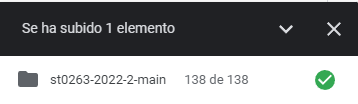
  

- Nos dirigimos a la siguiente direccion para poder abrir dos google colabs que son los que seran utilizados en este proyecto:   
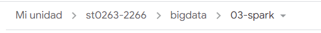   
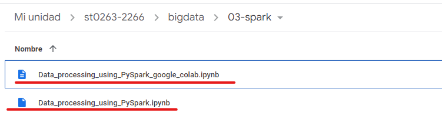   
Al momento de abrir estos dos archivos nos enviara a el google colab en el cual estaremos trabajando    
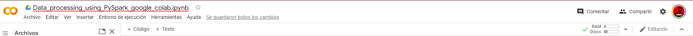
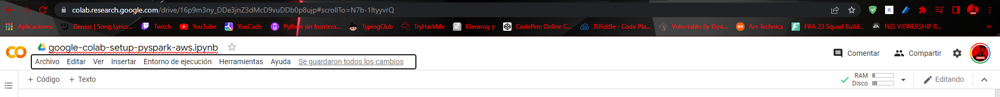

## Upload a AWS S3
Se hace la subida de la carpeta a el bucket en AWS S3:
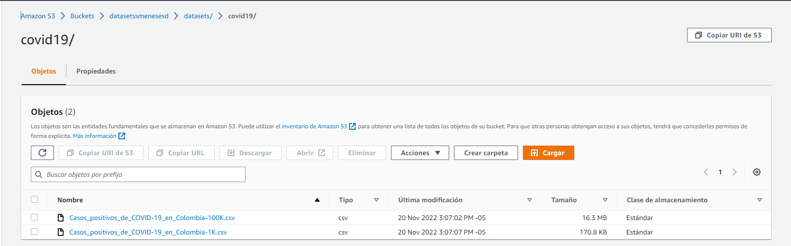

# 2. Análisis exploratorio del dataframe donde cargamos los datos
## Columnas   
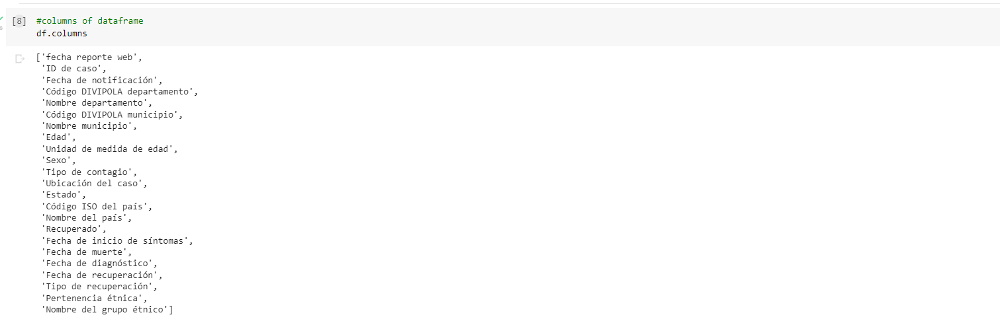
## Tipos de datos   

## Seleccionar algunas columnas    
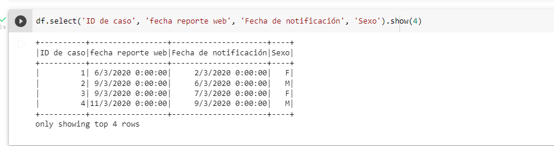    
## Renombrar columnas   
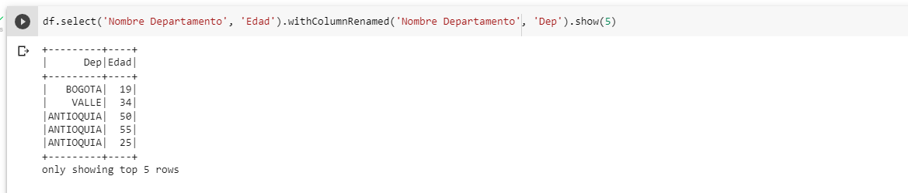   
## Agregar columnas   
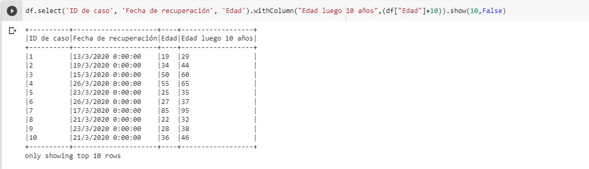
## Borrar columnas   
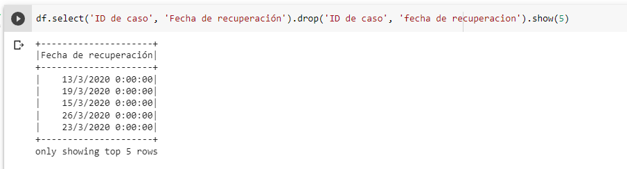  
## Filtrar datos    
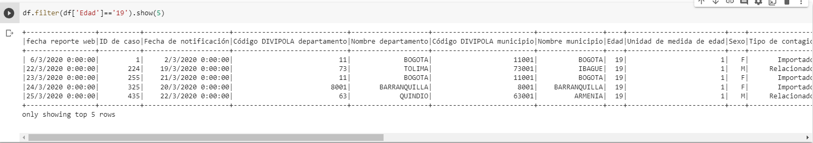
## Ejecutar alguna función UDF o lambda sobre alguna columna creando una nueva. 
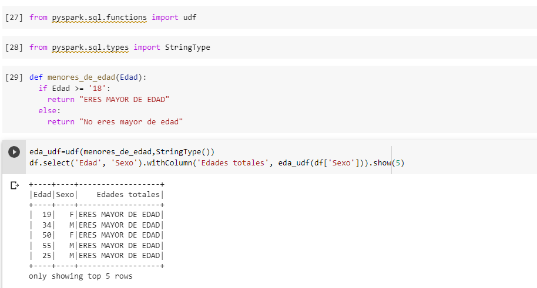 

# 3.
## Coodigo para usar PySparkSQL
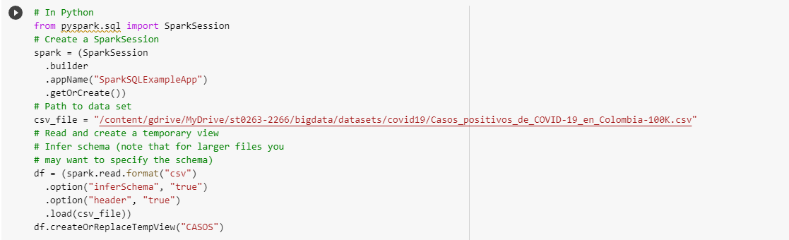
## 3.1 Los 10 departamentos con más casos de covid en Colombia ordenados de mayor a menor.
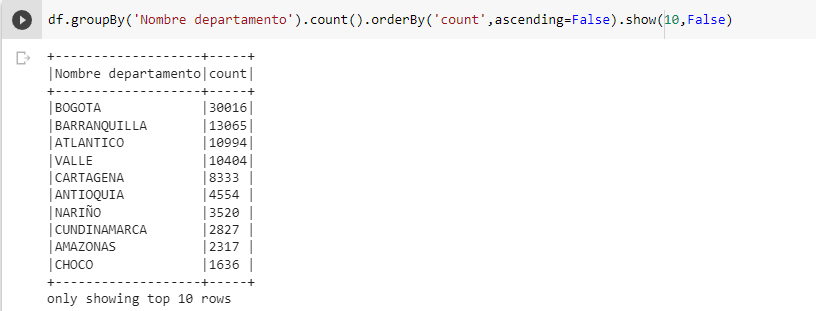
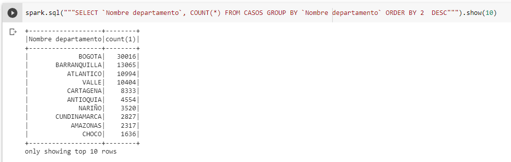
## 3.2 Las 10 ciudades con más casos de covid en Colombia ordenados de mayor a menor.
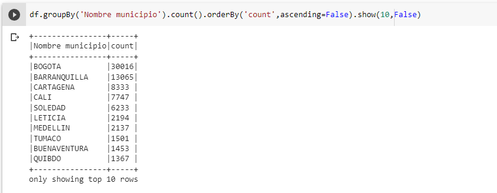
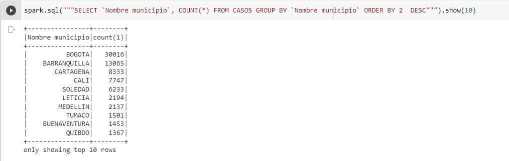
## 3.3 Los 10 días con más casos de covid en Colombia ordenados de mayor a menor.
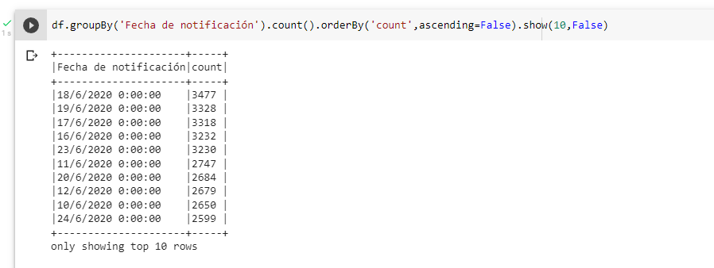
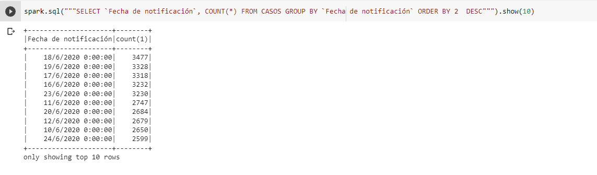
## 3.4 Distribución de casos por edades de covid en Colombia.
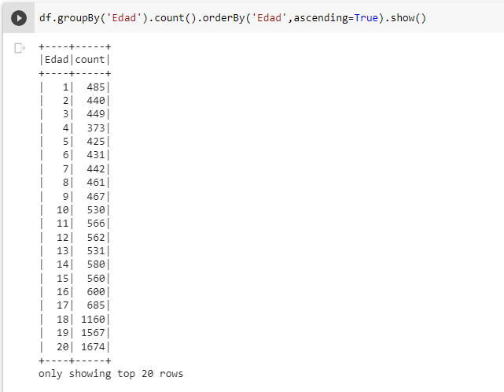
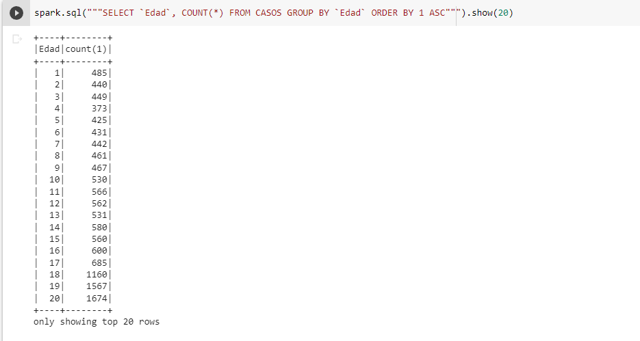
## 3.5 Realice la pregunda de negocio que quiera sobre los datos y respondala con la correspondiente programación en spark.
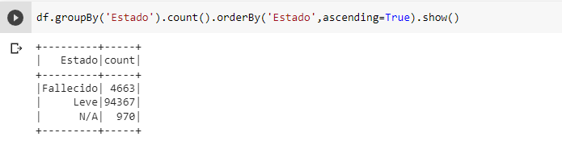
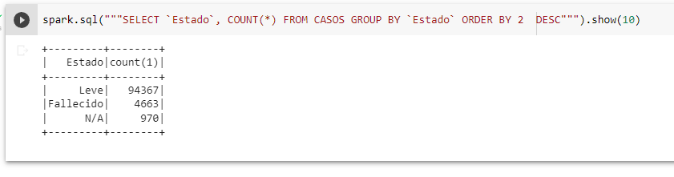

# 4. Se guardarons los datos del numeral 3 en el bucket 
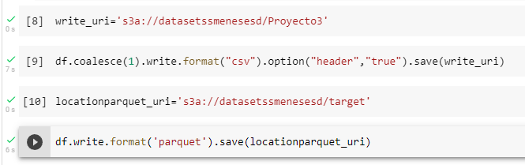

Se verifica que si se hayan guardados los datos en nuestro bucket desde AWS 
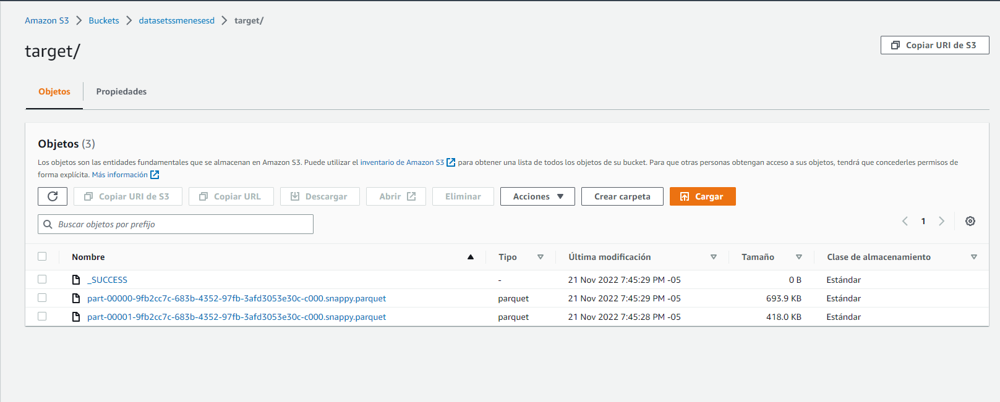
